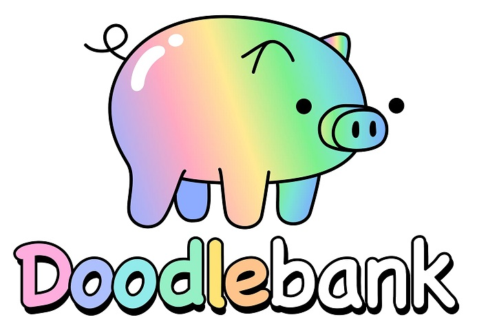

Doodles is a community-driven collectibles NFT project. Doodle NFTs are made up with over a hundred exciting traits of faces, hair, hats, body and backgrounds. Each Doodle is a unique, non-fungible token (NFT) on the Ethereum blockchain.

## Governance

If you have an idea that you are passionate about, it’s time to put on your wizard hat or queenly crown and become Doodle champion.

Version 0.1 of the Doodlebank allows Doodle owners to vote for heavily discussed proposals that are put forth by a champion and upgraded by the Founding team.

As a champion, you are responsible for fostering initial discussion, refinements, farming dissent and garnering support! Only when your idea is truly ready should you put it up for a preliminary proposal.

1. **Create a Discourse thread for your idea**

    Before an idea becomes a preliminary proposal, it must be discussed in our discourse forum to gather feedback, iterate and understand if there is worthy support. Once an idea feels “ready”, a preliminary proposal is created in [snapshot](https://snapshot.org/#/doodles.eth/) by its champion and a vote is called.

    The champion creates a discourse thread in [New Proposal Discussion](https://forum.doodles.app/c/new-proposal-discussion/1) to discuss their idea and prepare for the preliminary proposal. Here’s an [example discussion](https://forum.doodles.app/t/temporary-contract-for-doodles-animator/19).

2. **Creating a preliminary proposal**

    When an idea is ready for the next stage, the champion will use snapshot to conduct a temperature check vote on a preliminary proposal using the following template.

    * Doodle ID for Kudos: An ID of one of your Doodles. This might be used as a future surprise.
    * Discourse: Link to your thread in “New Proposal Discussions”
    * Rationale: Concise argument for your proposal
    * Timeline: When will kickoff be, milestone dates, any time expectations goes here
    * Goal: Set high level goals we will achieve. Numbers backed by past experience is even better
    * Cost: What is the ask?
    * Accountability: how is the money secured and managed? who will be accountable?
    * [See example of a final proposal here](https://snapshot.org/#/doodles.eth/proposal/QmdkAa6fccahEA2EYDBwhWJd8dmdAEDW4LiZ7ASW3ee6EV)

    Failing to follow the template or farm enough feedback/support will result in your proposal being removed by the founders.

    A quorum of 15% must be reached in order for the proposal to be upgraded. Because 1 Doodle = 1 vote, there must be a vote turnout of 1,500 Doodles (and majority support) before the proposal becomes eligible for an upgrade.

3. **Upgrading to a final proposal**

    Once a preliminary proposal reached quorum and majority support, the Founders will upgrade that proposal and reintroduce it as a **final proposal** adding necessary detail or context. We will try our best to stick to the original vision of the proposal but there is business, legal, and financial implications that need be considered and can potentially lead to restructuring.

    After a final proposal has been created it will be shared across the entire community to maximize voter turnout.

    * Voting for final proposals is done in snapshot
    * Final proposals are created by the founding team

    We acknowledge that proposals range in level of effort and cost so we want to set **quorum thresholds** that ensure we have higher turnout whenever more money is being spent

    * **Stacks** - the smallest of proposals. funding tooling, one-off activations, assets
        * 5% quorum
        * Less than 10 ETH
    * **Racks** - medium size proposals like long term contracts or experiences
        * 10% quorum
        * 10-25 ETH
    * **Duffel Bags** - major decisions and production expenses
        * 15% quorum
        * More than 25 ETH

    We look forward to collaborating on the future of Doodles with you all. Let’s make exciting proposals and learn a lot about coordination from Doodlebank v0.1!

## Additional resources:

* [Doodles](https://doodles.app/)
* [OpenSea](https://opensea.io/collection/doodles-official)
* [Discourse](https://forum.doodles.app/)
* [Snapshot](https://snapshot.org/#/doodles.eth)
* [Discord](https://discord.gg/doodles)
* [Twitter](https://twitter.com/doodles)
